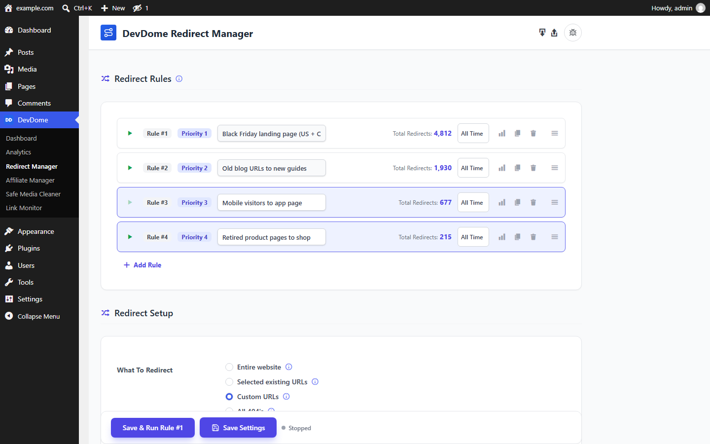
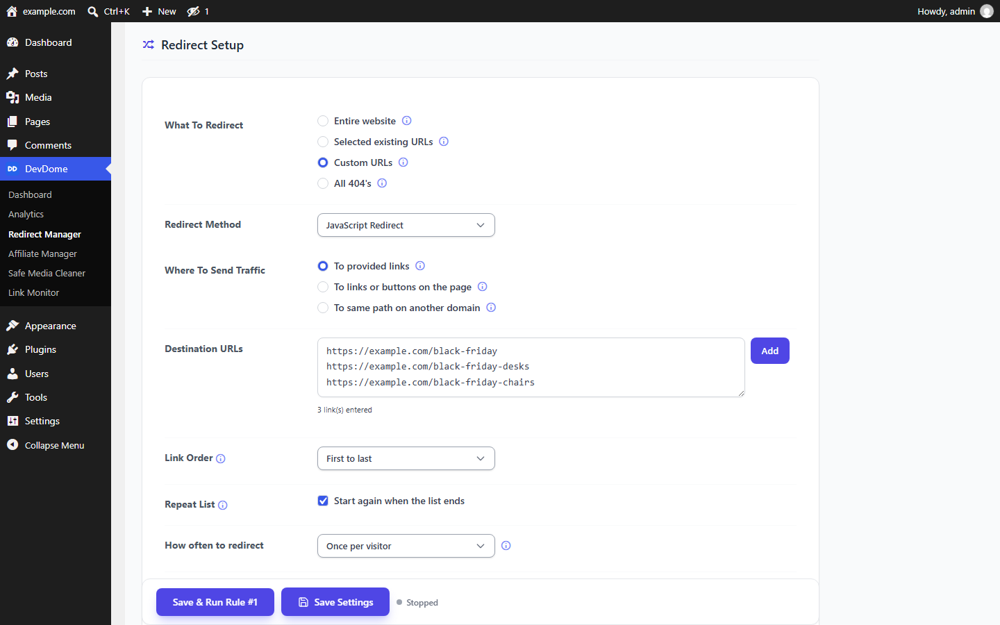
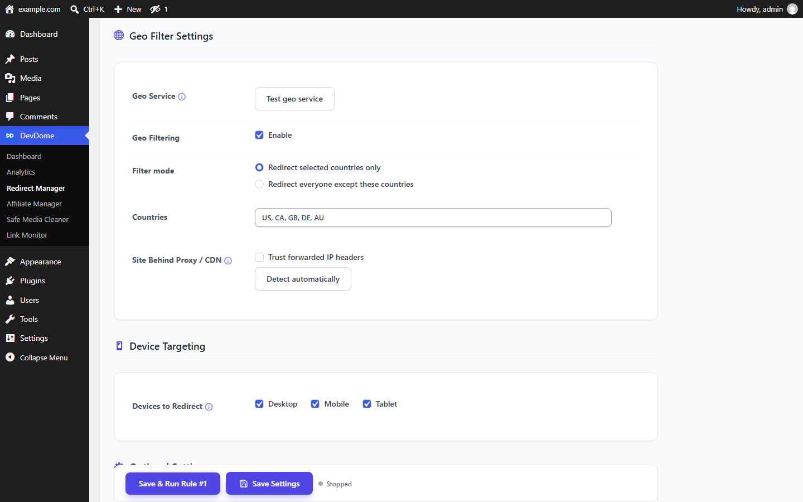
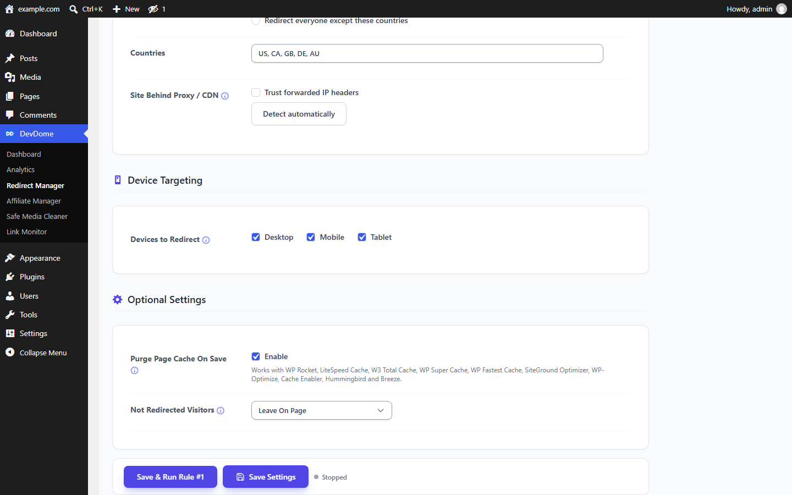
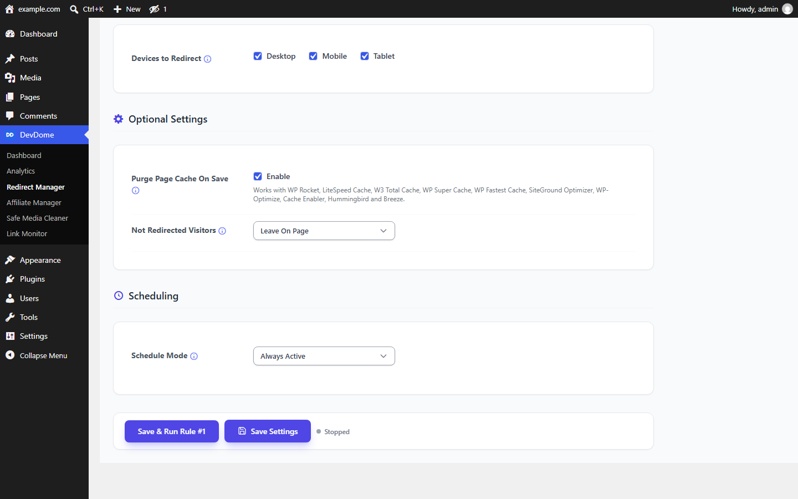

# DevDome Redirect Manager - free WordPress redirects with geo targeting, device targeting, link rotation and scheduling

**The free alternative to Pretty Links Pro, ThirstyAffiliates Pro, 301 Redirects Pro and Yoast Premium redirects.**
Redirect the whole site, selected pages, custom paths or every 404 with 301, 302, 307, 308, JavaScript or meta
refresh. Every rule gets its own geo filter, device filter, schedule, rotation order and click statistics.
Unlimited rules, no paid tier.

- **Install from WordPress.org:** https://wordpress.org/plugins/devdome-redirect-manager/
- **Website:** https://devdome.com
- **Support:** https://wordpress.org/support/plugin/devdome-redirect-manager/

## Why DevDome Redirect Manager instead of the alternatives

| | DevDome Redirect Manager | Redirection | Pretty Links | ThirstyAffiliates | 301 Redirects (WebFactory) | Yoast SEO |
|---|---|---|---|---|---|---|
| Price for geo targeting | **Free** | Not available | Marketer plan, $149.50 / year | Pro, from $99.60 / year | Pro, from $5.99 / month | Not available |
| Price for link rotation / split testing | **Free** | Not available | Pro | Not available | Pro | Not available |
| 301 / 302 / 307 / 308 redirects | Yes | Yes | Yes | Yes | Yes | Premium, $99 / year |
| Device targeting (desktop, mobile, tablet) | Yes | No | Pro | No | No | No |
| Scheduled redirects | Yes | No | No | No | No | No |
| Redirect every 404 to a page | Yes | Log only | No | No | Yes | No |
| Per-rule statistics | Yes | Log | Pro | Pro | Pro | No |
| Once per visitor, every N-th visitor | Yes | No | No | No | No | No |
| Unlimited rules | Yes | Yes | Per plan | Per plan | Per plan | Yes |

Prices are the vendors' published plans in September 2026. Redirection is a good free 301 tool; it has no geo,
device, rotation or scheduling. Rank Math includes redirects only as part of its full SEO suite.

## Features

- **What to redirect:** the entire website, selected posts, pages and categories, a list of custom paths, or every
  404 page.
- **Where to:** one URL, a rotating list (first to last, random, or weighted with a slider), a link or button already
  on the page, or the same path on another domain.
- **Method:** 301, 302, 307, 308, JavaScript (with optional delay, new tab, or wait-for-click), meta refresh.
- **Frequency:** every visit, once per visitor (by IP or IP plus device), or again after a delay you set; redirect
  only every N-th unique visitor.
- **Geo filter:** include only listed countries, or redirect everyone except them. Proxy and CDN aware.
- **Device targeting:** desktop, mobile, tablet.
- **Scheduling:** start and end date and time, your timezone.
- **Statistics per rule**, purge page cache on save (WP Rocket, LiteSpeed, W3 Total Cache, WP Super Cache and
  more), import and export.

## Screenshots

*Redirect rules: independent rules with priority, nickname and statistics.*

*Redirect setup: targets, method, destinations, rotation order and frequency.*

*Geo filter: listed countries only, or everyone except them.*

*Device targeting and optional settings.*

*Scheduling: run a rule between dates and times.*

## Requirements

WordPress 6.0+, PHP 7.4+. Geo filtering uses the DevDome geo service.

## Installation

1. In wp-admin go to **Plugins > Add New**, search for **DevDome Redirect Manager**, install and activate.
2. Open **DevDome > Redirect Manager**, add a rule, choose what to redirect and where, save and run.

## Part of the DevDome plugin family

Free WordPress plugins by [DevDome](https://devdome.com): Analytics (cookieless, bot and AI crawler split, public
API and MCP server), Redirect Manager, Media Cleaner, Link Monitor, Affiliate Manager. Every plugin ships with the
DevDome Dashboard inside wp-admin, so the others install in one click.

## Development

This repository mirrors the release published on WordPress.org. Bug reports and feature requests: open an issue here
or use the [support forum](https://wordpress.org/support/plugin/devdome-redirect-manager/).

## License

GPL-2.0 or later. See [LICENSE](LICENSE).
